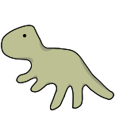
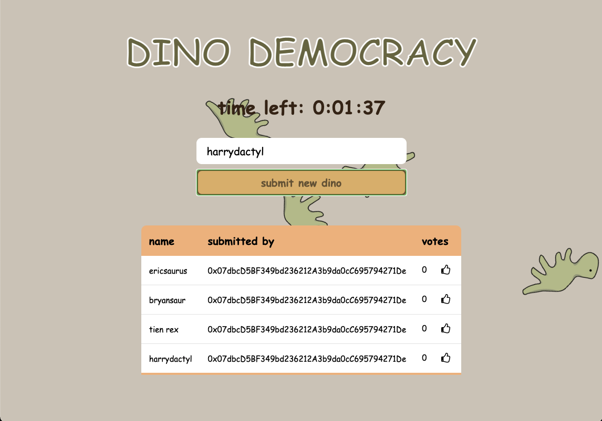
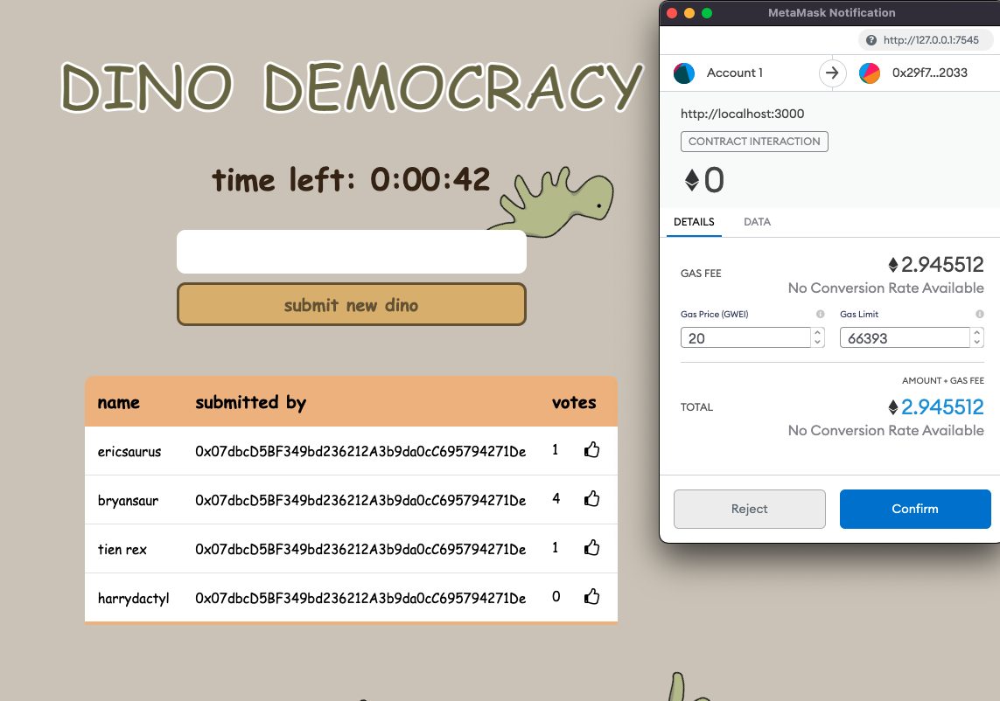
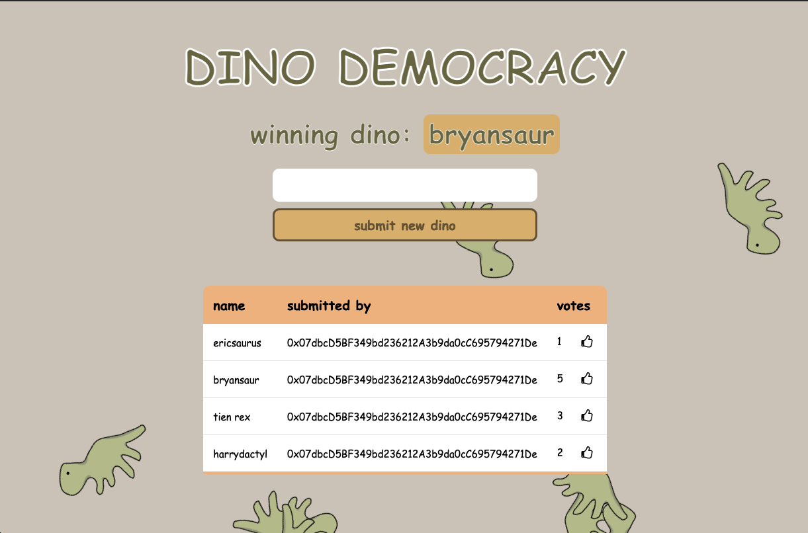

<header>
  <div align="center">
    
  </div>
  <h2 align="center">Dino Democracy</h3>
  <p align="center">
    dApp to vote on the name of the newest dinosaurs
  </p>
</header>

### About this Project
This toy project was made to explore and learn technologies for making decentralized applications. 

### Features
#### Submitting a New Dino Name

#### Voting on a Dino Name


#### Displaying the Winner

### Technology Used
* [Truffle Suite]("https://www.trufflesuite.com/")
* [Solidity](https://docs.soliditylang.org/en/v0.8.6/)
* [web3.js](https://web3js.readthedocs.io/en/v1.3.4/)
* [React](https://www.trufflesuite.com/boxes/react)

### Getting Started

1. Install truffle with `npm install truffle -g`
2. Install [Ganache](https://www.trufflesuite.com/ganache)
3. Set up a new workspace and point it to truffle-config.js in the root directory. 
4. In the root directoy run 
```
truffle compile
truffle migrate
```
5. cd into the client directory and run
```npm i
npm start
```
6. Install [MetaMask](https://chrome.google.com/webstore/detail/metamask/nkbihfbeogaeaoehlefnkodbefgpgknn)
7. Head to [localhost:3000](http://localhost:3000/) and the MetaMask overlay should pop up. 
8. Click **import using Secret Recovery Phrase** and paste in the code from Ganache. 
9. Checkout the [Truffle tutorial](https://www.trufflesuite.com/tutorial) for additional details on setting up.

